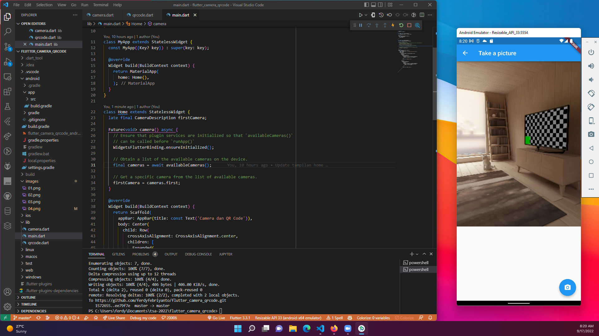

# #30 | Camera dan QR Codes

## Tujuan Praktikum

* Mampu menerapkan fungsi kamera pada aplikasi Flutter
* Mampu menerapkan plugin QR Codes

## Persiapan

Plugin

* camera
* path_provider
* path
* qr_code_scanner

android/app/buid.gradle 

* compileSdkVersion 32
* minSdkVersion 21

Aplikasi terdiri dari 3 file meliputi:

* main.dart
* camera.dart
* qrcode.dart 

## Hasil Praktikum

