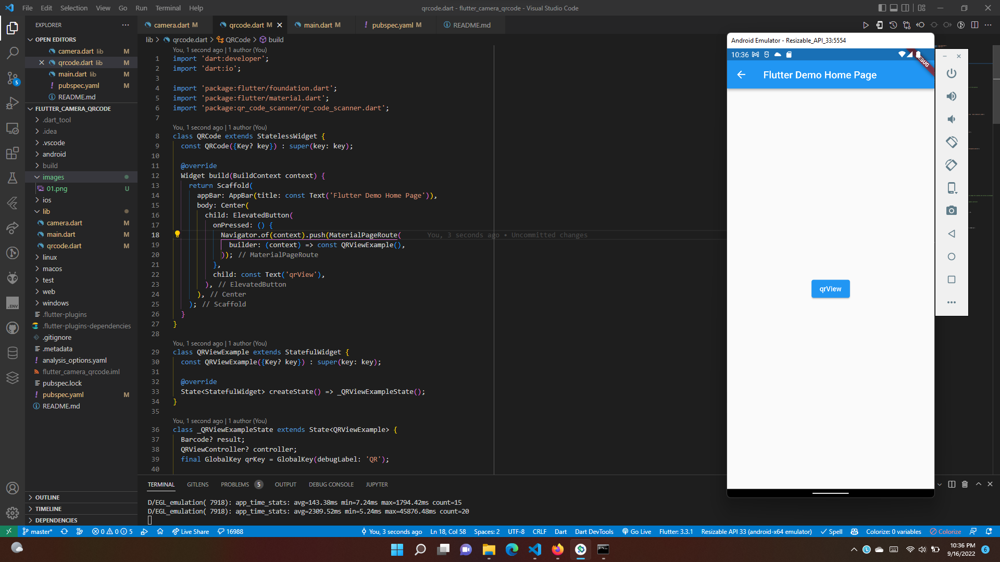
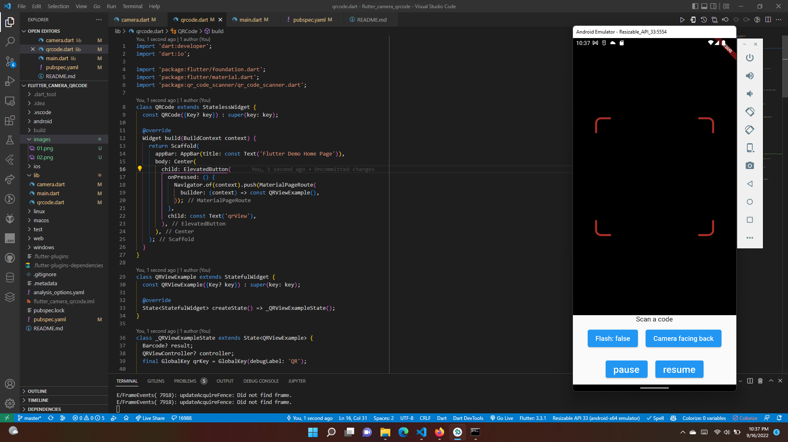
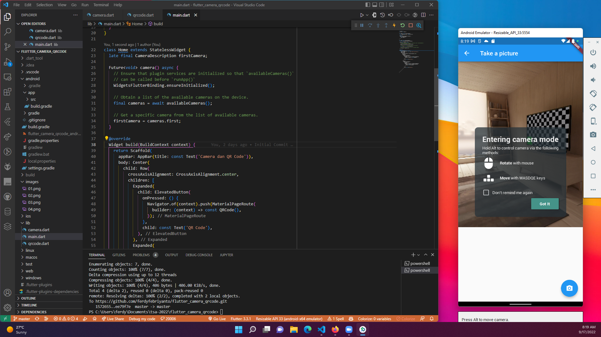

# #30 | Camera dan QR Codes

## Tujuan Praktikum

* Mampu menerapkan fungsi kamera pada aplikasi Flutter
* Mampu menerapkan plugin QR Codes

## Persiapan

Plugin

* camera
* path_provider
* path
* qr_code_scanner

android/app/buid.gradle 

* compileSdkVersion 32
* minSdkVersion 21

Aplikasi terdiri dari 3 file meliputi:

* main.dart
* camera.dart
* qrcode.dart 

## Hasil Praktikum

* Halaman Home, terdapat 2 button, yaitu QR Code dan Camera

* Halaman QR Code, terdapat button untuk scan QR Code

* Halaman QR Code, terdapat beberapa button
    * Flash: untuk menyalakan lampu flash
    * Camera facing back: untuk mengganti kamera belakang
    * Camera facing front: untuk mengganti kamera depan
    * Pause: untuk menghentikan scan QR Code
    * Resume: untuk melanjutkan scan QR Code

* Halaman Camera, terdapat button untuk mengambil gambar
* Namun disini terdapat kendala error

